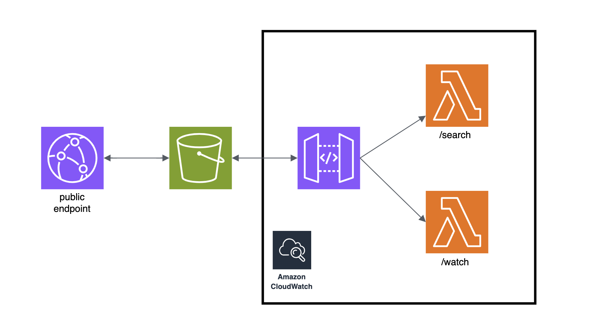
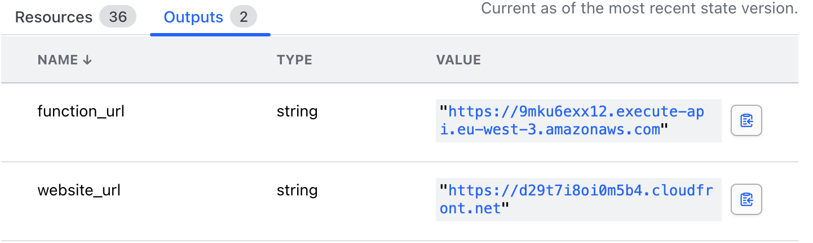

# Who Streams It?

This project was built to demonstrate my understanding of Terraform and AWS. It provisions a simple web application that lets you search for a movie title and discover where it’s available to stream. You can optionally filter by streaming service and country to see which providers's catalogs currently include the movie you’re looking for.


## Prerequisites

To run this project, make sure you have:

- **Terraform** installed (v1.x recommended).
- **AWS credentials** available as environment variables:
  - `AWS_ACCESS_KEY_ID`
  - `AWS_SECRET_ACCESS_KEY`
- A **TMDB API key** (`tmdb_key`).
- Your desired **AWS region** (e.g., `eu-west-3`).

> You can load real values from a `.env` or your CI/CD secrets manager.

## Terraform Cloud / Remote Backend

This project uses **Terraform Cloud** as a remote backend. You can keep that setup or switch to a different backend if you prefer.

### Option A — Terraform Cloud (recommended)

Edit `infra/main.tf` and set your organization and workspace:


```hcl
terraform {

  backend "remote" {
    organization = "YOUR_ORG"
    workspaces {
      name = "YOUR_WORKSPACE"
    }
  }
}
```
### Option B — Local state (for quick testing)

If you don’t want a remote backend, you can use local state:


```hcl
terraform {
  backend "local" {
    path = "./terraform.tfstate"
  }
}
```

### Environment and Terraform variables

To run the stack, define the following variables. Use **environment variables** for AWS credentials and **Terraform variables** for project-specific values.

| Variable                | Defined In | Value / Description       |
|-------------------------|-----------:|---------------------------|
| `AWS_ACCESS_KEY_ID`     | env        | YOUR AWS ACCESS KEY       |
| `AWS_SECRET_ACCESS_KEY` | env        | YOUR AWS SECRET           |
| `tmdb_key`              | Terraform  | YOUR TMDB API key         |
| `aws_region`            | Terraform  | YOUR DESIRED AWS REGION   |


### AWS Policy for Terraform

Terraform needs permissions to create and manage the AWS resources defined in this project. Use the **minimum policy** provided at `infra/policy.json`.

**Attach the policy**

1. In the AWS Console: **IAM → Policies → Create policy**.  
2. Paste the JSON from `infra/policy.json` and create the policy.
3. Attach the policy to the **IAM user or role** whose credentials (Access Key ID / Secret) Terraform will use.

## Description

### AWS Infrastructure

This project provisions a **serverless** architecture that powers the application end-to-end:

- **Amazon S3** — hosts the single-page application (SPA).
- **AWS CloudFront** — serves as the public entry point for the SPA.
- **Amazon API Gateway** — public entry point for API requests from the SPA.
- **AWS Lambda** — stateless functions handling the business logic.
- **Amazon CloudWatch Logs** — centralized logging for debugging and traceability.



**How it works**

1. The SPA is stored in an S3 bucket, which is secured with an Origin Access Control (OAC) so that only CloudFront can serve its content.  
2. CloudFront acts as the public entry point, delivering the SPA to users.  
3. User interactions trigger API requests routed through API Gateway.  
4. API Gateway invokes the appropriate Lambda functions.  
5. Lambdas handle the request and return the response to the SPA.  
6. API activity is logged in **CloudWatch Logs**.  


---

### The Web Application

The frontend is a single-page website hosted on S3:


**Features**

- Search by movie title.
- Optional filters:
  - **Country** (first dropdown).
  - **Streaming provider** (second dropdown).

---

### Accessing the Application

After applying the Terraform configuration, use the URL printed in the Terraform **outputs** to open the website:




## Main Functions

### Code layout
- `search.mjs` and `watch.mjs` — Lambda handlers.
- `core.js` — shared helpers used by `watch.mjs` (the `/watch` Lambda). The `/search` Lambda does **not** depend on it.

### Workflow

#### Search for matches (`/search` Lambda)
Queries TMDB for titles matching the user’s input. Runs standalone and does not require `core.js`.

#### Resolve a title
`resolveTitle()` asks TMDB for detailed metadata (IDs, release year, runtime, etc.) for the selected movie.

#### Filter by provider
Because TMDB cannot filter providers in the query itself, `pickStreaming()` filters the provider list **after** retrieval to keep only the user-selected services (and country, if supplied).

#### Orchestrate “where to stream”
`whereToStream()` combines `resolveTitle()` and `pickStreaming()` into a single flow. It is called by the `/watch` Lambda (`watch.mjs`) to keep the handler small while centralizing API calls and filtering logic.

---

## Possible Improvements

- **Tighten IAM**: replace wildcard actions/resources with explicit ARNs; restrict each Lambda’s execution role to only required permissions.
- **Secret management**: store `tmdb_key` in AWS Secrets Manager or SSM Parameter Store (with KMS)
- **Observability**: generate detailed logs of API actions to improve traceability and make debugging more convenient.

